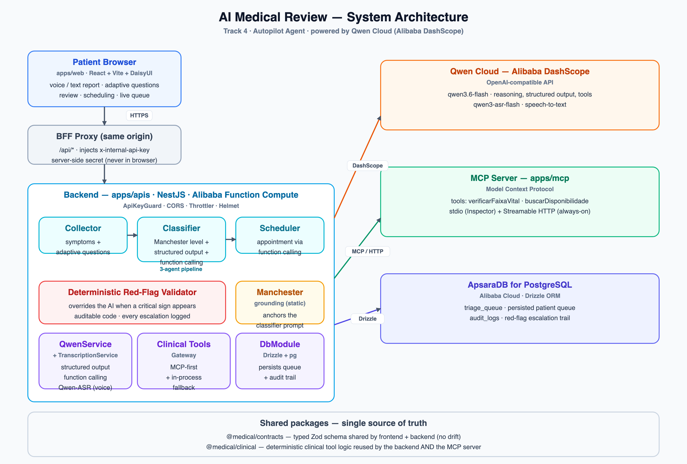
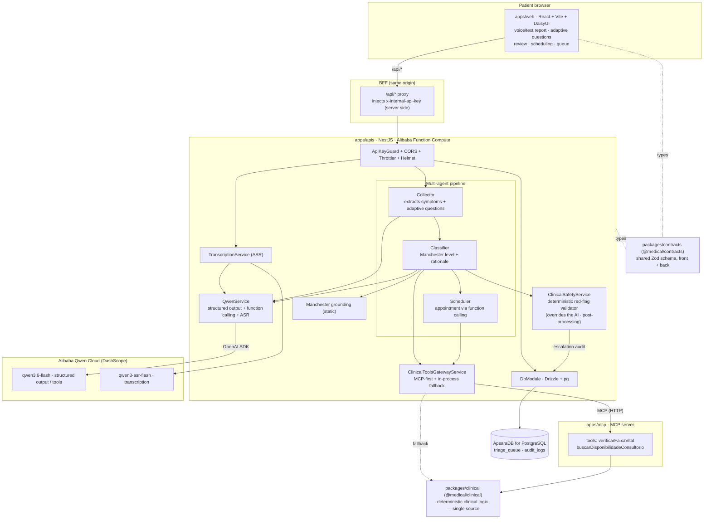

# Architecture — AI Medical Review

A **medical pre-triage agent** (Manchester Protocol) built on **Qwen Cloud
(DashScope)**. Track 4 — Autopilot Agent.

> Image: [`architecture.png`](./architecture.png) · vector:
> [`architecture.svg`](./architecture.svg) · regenerate:
> `python3 docs/architecture.gen.py` (then render the SVG). The Mermaid source
> below is the editable version.

## Diagram

## Flows

1. **Analyze (`POST /api/triage/analyze`)** — the Collector extracts
   symptoms/red-flags and generates adaptive questions. The deterministic
   validator augments the red-flags.
2. **Classify (`POST /api/triage/classify`)** — the Classifier produces the
   Manchester level using **structured output** + **function calling** (vital
   ranges, availability). The deterministic validator **overrides** the AI when a
   critical sign is present; every escalation is written to `audit_logs`. The
   appointment comes from the tool-executor trail, not from model text.
3. **Transcribe (`POST /api/triage/transcrever`)** — audio → editable text
   (Qwen-ASR), a human-in-the-loop checkpoint.
4. **Queue (`GET/POST /api/triage/queue*`)** — persisted queue; ordered by
   severity, ties broken by arrival time; team panel via polling.

## Key decisions

- **No vector RAG.** Static Manchester grounding + structured output +
  deterministic validator + function calling. Critical knowledge becomes
  **auditable code**, not model memory. (ADR-05)
- **MCP as the canonical tool host.** The same `@medical/clinical` tools are
  exposed over MCP and consumed by the backend (MCP-first, with in-process
  fallback). (ADR-06)
- **Single typed contract** (`@medical/contracts`) front↔back, no drift.
- **Alibaba Cloud:** the backend runs on **Alibaba Function Compute**, reasons on
  **Qwen Cloud (DashScope)** — usage in
  [`apps/apis/src/qwen/qwen.service.ts`](../apps/apis/src/qwen/qwen.service.ts) —
  and persists to **ApsaraDB for PostgreSQL**.
- **Persistence** via Drizzle + `pg` on ApsaraDB (queue + audit trail).

## Anti-hallucination (layers)

1. Static grounding (Manchester table in the prompt)
2. Structured output (schema enforces the format)
3. Rationale + determining factors (auditable reasoning)
4. Function calling (verifiable facts come from code)
5. **Deterministic red-flag validator** (overrides the AI) — see
   [`red-flag-tests.md`](./red-flag-tests.md)
